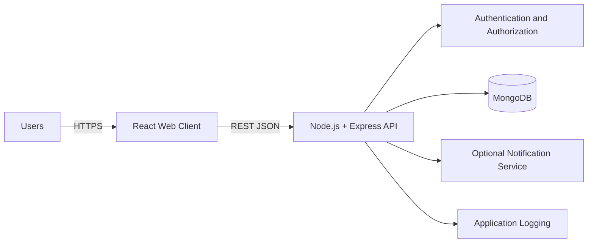
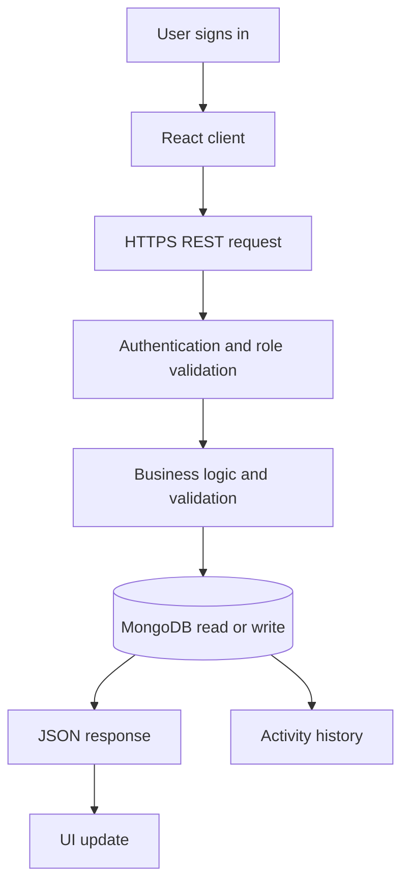

# TeamFlow Week 2 Design Record

## Architecture
TeamFlow uses a layered client server architecture:

## Data Flow

## Major Components
- React Web Client
- Authentication Module
- Authorization Module
- Project Module
- Task Module
- Collaboration Module
- Dashboard Module
- Notification Module
- Reporting Module
- Data Access Module
- Logging and Error Module

## Representative API Surface
| Method | Endpoint | Purpose |
|---|---|---|
| POST | `/api/v1/auth/login` | Authenticate user |
| GET | `/api/v1/projects` | List accessible projects |
| POST | `/api/v1/projects` | Create project |
| GET | `/api/v1/projects/{projectId}` | Get project details |
| POST | `/api/v1/projects/{projectId}/tasks` | Create task |
| PATCH | `/api/v1/tasks/{taskId}` | Update task |
| GET | `/api/v1/tasks` | Search and filter tasks |
| POST | `/api/v1/tasks/{taskId}/comments` | Add comment |
| GET | `/api/v1/dashboard/summary` | Load dashboard |
| GET | `/api/v1/reports/projects/{projectId}` | Project report |

## Design Principles
1. Frontend must not access the database directly.
2. Authentication and authorization are enforced at backend boundaries.
3. Business rules belong in service logic rather than UI components.
4. Database operations are isolated behind a data access layer.
5. External notification delivery is replaceable.
6. Secrets and credentials are kept outside source control.
7. Git history is used to maintain a traceable weekly project record.

## Next Week
Week 3 will move from design to initial implementation and focus on project scaffolding, authentication, protected routes, database models and the first end to end workflow.
